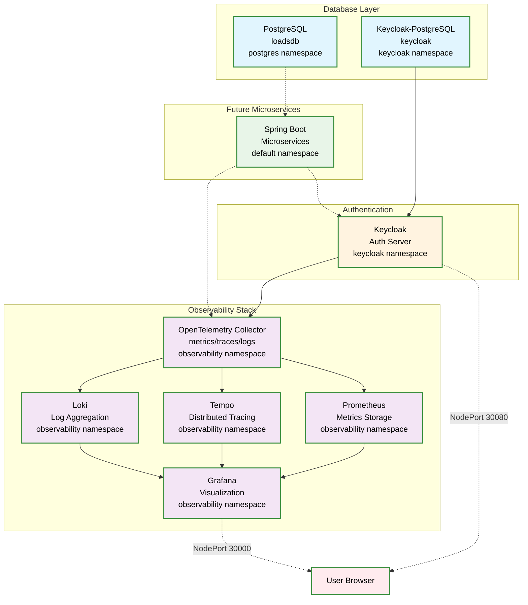

# Spring Load Development - Infrastructure Helm Chart

This Helm chart deploys the core infrastructure components for the Spring Load Development project on Kubernetes, providing a production-ready foundation for microservices deployment.

## Overview

The Helm chart deploys and manages:
- **Two PostgreSQL Instances** - Separate databases for microservices and Keycloak
- **Keycloak** - Authentication and authorization server with realm configuration
- **Complete Observability Stack** - Loki, Tempo, Prometheus, Grafana, and OpenTelemetry Collector
- **All networking and storage** - Services, persistent volumes, and NodePort access

## Architecture



## Quick Start

### Prerequisites
- Kubernetes cluster (Docker Desktop, minikube, or cloud provider)
- Helm 3.x installed
- kubectl configured

### 1. Deploy Infrastructure

```bash
# Clone the repository
git clone <your-repo-url>
cd spring-load-development/helm/spring-load-development

# Deploy the infrastructure
helm install spring-load-development . \
  --values values.yaml \
  --create-namespace \
  --timeout 300s

# Or upgrade if already installed
helm upgrade spring-load-development . \
  --values values.yaml \
  --timeout 300s
```

### 2. Access Services

#### NodePort Access (Docker Desktop/Local)
- **Grafana**: http://localhost:30000 (anonymous access enabled)
- **Keycloak**: http://localhost:30080 (admin/admin)
- **Prometheus**: http://localhost:30091
- **Loki**: http://localhost:30100
- **Tempo**: http://localhost:30200

#### Port Forward Access
```bash
# Grafana
kubectl port-forward svc/grafana-service 3000:3000 -n observability

# Keycloak  
kubectl port-forward svc/keycloak-service 8080:8080 -n keycloak
```

## Components

### PostgreSQL Databases

#### Microservices Database
- **Namespace**: `postgres`
- **Service**: `postgres-service.postgres.svc.cluster.local:5432`
- **Database**: `loadsdb`
- **Credentials**: `user` / `password`
- **Purpose**: For Spring Boot microservices data storage

#### Keycloak Database  
- **Namespace**: `keycloak`
- **Service**: `keycloak-postgres-service.keycloak.svc.cluster.local:5432`
- **Database**: `keycloak`
- **Credentials**: `user` / `password`
- **Purpose**: Dedicated for Keycloak authentication data

### Keycloak Authentication Server
- **Version**: 26.3
- **Admin Console**: http://localhost:30080
- **Admin Credentials**: `admin` / `admin`
- **Features**:
  - PostgreSQL backend with dedicated database
  - Realm import enabled with custom realm configuration
  - OpenTelemetry tracing to Tempo
  - Health checks enabled
  - Development mode for local testing

### Observability Stack

#### Loki (Log Aggregation)
- **Version**: 3.5.3
- **Port**: 30100
- **Storage**: Filesystem with 10Gi persistent volume
- **Retention**: 6 hours
- **Purpose**: Centralized log collection and querying

#### Tempo (Distributed Tracing)
- **Version**: 2.8.2  
- **Port**: 30200
- **Storage**: Local filesystem with 10Gi persistent volume
- **Features**: OTLP receivers, metrics generation, trace querying

#### Prometheus (Metrics)
- **Version**: v3.5.0
- **Port**: 30091
- **Storage**: 10Gi persistent volume
- **Retention**: 24 hours
- **Scrape Targets**: OpenTelemetry Collector metrics

#### Grafana (Visualization)
- **Version**: 12.1.1
- **Port**: 30000
- **Authentication**: Anonymous access enabled (Admin role)
- **Datasources**: Pre-configured Loki, Tempo, and Prometheus
- **Features**: 
  - Cross-datasource correlation (traces ↔ metrics ↔ logs)
  - Exemplar support for trace sampling
  - 5Gi persistent storage

#### OpenTelemetry Collector
- **Version**: 0.132.0
- **GRPC Port**: 30317
- **Metrics Port**: 30889
- **Purpose**: 
  - Collect telemetry from applications
  - Export logs to Loki
  - Export traces to Tempo  
  - Export metrics to Prometheus
  - Health checks and monitoring

## Configuration

### Main Configuration File

All infrastructure configuration is managed through a single `values.yaml` file with the following main sections:

```yaml
# PostgreSQL for microservices
postgresql:
  enabled: true
  namespace: postgres
  database: loadsdb
  username: user
  password: password
  storage: 10Gi

# PostgreSQL for Keycloak
keycloakPostgresql:
  enabled: true
  namespace: keycloak
  database: keycloak
  username: user
  password: password
  storage: 5Gi

# Authentication server
keycloak:
  enabled: true
  namespace: keycloak
  adminUsername: admin
  adminPassword: admin
  importRealm: true

# Observability components
loki:
  enabled: true
  namespace: observability
  storage: 10Gi

tempo:
  enabled: true
  namespace: observability
  storage: 10Gi

prometheus:
  enabled: true
  namespace: observability
  storage: 10Gi

grafana:
  enabled: true
  namespace: observability
  storage: 5Gi
  anonymousAccess: true

otelCollector:
  enabled: true
  namespace: observability
```

### Customizing Configuration

#### Storage Volumes
```yaml
# Increase PostgreSQL storage
postgresql:
  storage: 20Gi

# Increase observability storage
loki:
  storage: 50Gi
tempo:
  storage: 100Gi
```

#### External Access
```yaml
# Change NodePort ranges
nodePort:
  grafana: 30000      # Default
  keycloak: 30080     # Default
  prometheus: 30091   # Default
  loki: 30100         # Default
  tempo: 30200        # Default
  otelGrpc: 30317     # Default
  otelMetrics: 30889  # Default
```

#### Keycloak Configuration
```yaml
keycloak:
  adminUsername: myadmin    # Change admin username
  adminPassword: mysecret   # Change admin password
  importRealm: false        # Disable realm import
```

## Deployment

### Standard Deployment
```bash
# Deploy infrastructure
helm install spring-load-development . \
  --values values.yaml \
  --create-namespace \
  --timeout 300s
```

### Custom Configuration
```bash
# Create custom values
cp values.yaml values-custom.yaml
# Edit values-custom.yaml as needed

# Deploy with custom configuration
helm install spring-load-development . \
  --values values-custom.yaml \
  --create-namespace \
  --timeout 300s
```

### Upgrade Existing Installation
```bash
# Upgrade infrastructure
helm upgrade spring-load-development . \
  --values values.yaml \
  --timeout 300s
```

## Database Access

### Microservices PostgreSQL
```bash
# Connect to database
kubectl exec -it postgres-0 -n postgres -- psql -U user -d loadsdb

# Port forward for external access
kubectl port-forward postgres-0 5432:5432 -n postgres
```

### Keycloak PostgreSQL
```bash
# Connect to Keycloak database
kubectl exec -it keycloak-postgres-0 -n keycloak -- psql -U user -d keycloak

# Port forward for external access
kubectl port-forward keycloak-postgres-0 5433:5432 -n keycloak
```

## Monitoring and Observability

### Grafana Dashboards
- **Access**: http://localhost:30000
- **Authentication**: Anonymous (Admin role)
- **Pre-configured datasources**: Loki, Tempo, Prometheus
- **Cross-datasource correlation**: Click trace IDs in logs to view in Tempo

### Log Aggregation (Loki)
```bash
# Access Loki directly
curl http://localhost:30100/ready

# Query logs via API
curl 'http://localhost:30100/loki/api/v1/query?query={container="keycloak"}'
```

### Distributed Tracing (Tempo)
```bash
# Access Tempo directly
curl http://localhost:30200/status

# Send traces to OpenTelemetry Collector
# Applications should export to: http://otel-collector:4317
```

### Metrics (Prometheus)
```bash
# Access Prometheus UI
open http://localhost:30091

# Query metrics
curl 'http://localhost:30091/api/v1/query?query=up'
```

## Application Integration

### PostgreSQL Connection (Microservices)
```yaml
# Spring Boot application.yml
spring:
  r2dbc:
    url: r2dbc:postgresql://postgres-service.postgres.svc.cluster.local:5432/loadsdb
    username: user
    password: password
```

### OpenTelemetry Configuration
```yaml
# Send telemetry to collector
otel:
  exporter:
    otlp:
      endpoint: http://otel-collector.observability.svc.cluster.local:4317
  resource:
    attributes:
      service.name: my-microservice
```

### Keycloak Integration
```yaml
# Spring Security OAuth2 configuration
spring:
  security:
    oauth2:
      resourceserver:
        jwt:
          issuer-uri: http://keycloak-service.keycloak.svc.cluster.local:8080/auth/realms/spring-loads
```

## Troubleshooting

### Common Issues

#### PostgreSQL Connection Issues
```bash
# Check PostgreSQL status
kubectl get pods -n postgres
kubectl logs postgres-0 -n postgres

# Check service DNS resolution
kubectl run test-pod --image=busybox --rm -it -- nslookup postgres-service.postgres.svc.cluster.local
```

#### Keycloak Admin Login Issues
```bash
# Check Keycloak logs
kubectl logs deployment/keycloak -n keycloak

# Verify admin user creation
kubectl exec -it deployment/keycloak -n keycloak -- cat /opt/keycloak/conf/keycloak.conf

# Reset Keycloak database if needed
kubectl delete pvc keycloak-postgres-pvc -n keycloak
helm upgrade spring-load-development . --values values.yaml
```

#### Observability Stack Issues
```bash
# Check all observability components
kubectl get all -n observability

# Test OpenTelemetry Collector
kubectl port-forward svc/otel-collector 4317:4317 -n observability
# Send test trace to localhost:4317

# Check Grafana datasources
curl http://localhost:30000/api/datasources
```

### Health Checks
```bash
# Check all component health
kubectl get pods --all-namespaces | grep -E "(postgres|keycloak|grafana|loki|tempo|prometheus|otel)"

# Detailed pod status
kubectl describe pod <pod-name> -n <namespace>

# Component logs
kubectl logs <pod-name> -n <namespace> -f
```

### Port Forward Everything
```bash
# Forward all services for testing
kubectl port-forward svc/grafana-service 3000:3000 -n observability &
kubectl port-forward svc/keycloak-service 8080:8080 -n keycloak &
kubectl port-forward svc/prometheus-service 9090:9090 -n observability &
kubectl port-forward svc/loki-service 3100:3100 -n observability &
kubectl port-forward svc/tempo-service 3200:3200 -n observability &
kubectl port-forward postgres-0 5432:5432 -n postgres &
kubectl port-forward keycloak-postgres-0 5433:5432 -n keycloak &
```

### Reset Infrastructure
```bash
# Complete reset (deletes all data)
helm uninstall spring-load-development
kubectl delete namespace postgres keycloak observability
kubectl delete pvc --all --all-namespaces

# Redeploy
helm install spring-load-development . --values values.yaml --create-namespace --timeout 300s
```

## Scaling and Production

### Resource Adjustments
```yaml
# Increase replicas for high availability
postgresql:
  replicas: 3
  
keycloak:
  replicas: 2
  
# Increase resource limits
prometheus:
  resources:
    limits:
      cpu: 2000m
      memory: 4Gi
```

### Backup Strategy
```bash
# PostgreSQL backup
kubectl exec postgres-0 -n postgres -- pg_dump -U user loadsdb > backup-microservices.sql
kubectl exec keycloak-postgres-0 -n keycloak -- pg_dump -U user keycloak > backup-keycloak.sql

# Persistent volume snapshots (cloud providers)
kubectl get pvc --all-namespaces
```

### Security Hardening
- Change default passwords in production
- Enable TLS for all services
- Configure network policies
- Use proper RBAC
- Enable audit logging

## Chart Information
- **Chart Version**: 0.0.7-SNAPSHOT
- **Kubernetes Version**: 1.24+
- **Helm Version**: 3.x
- **Dependencies**: None (all components included)